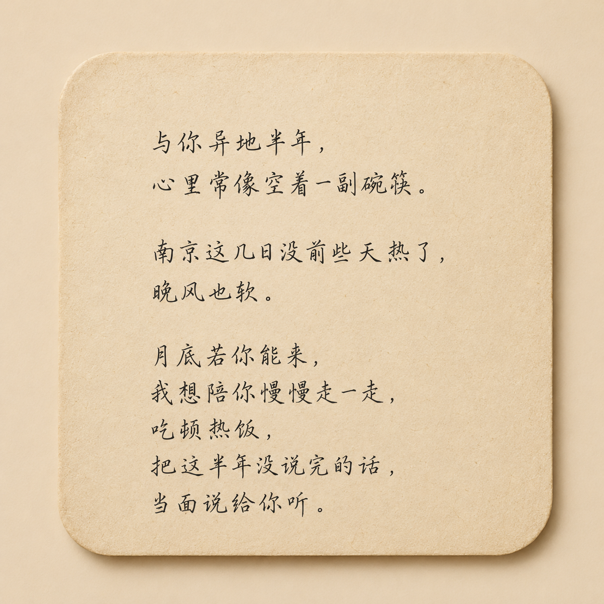
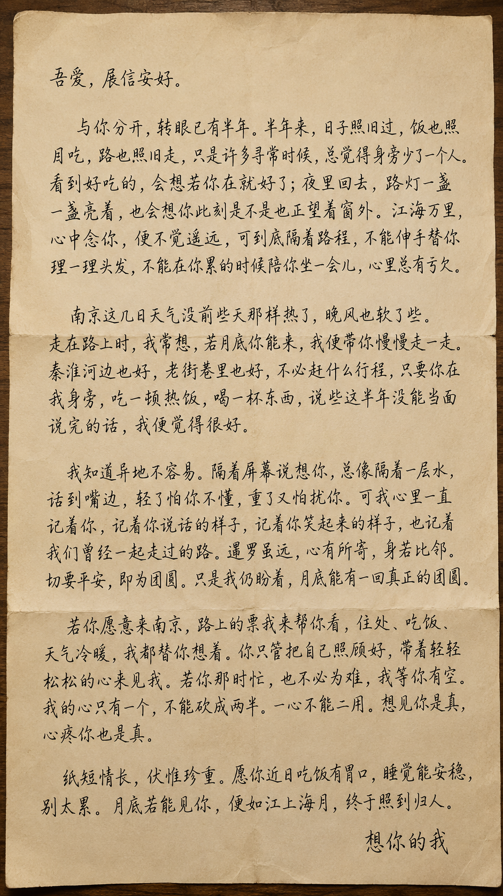
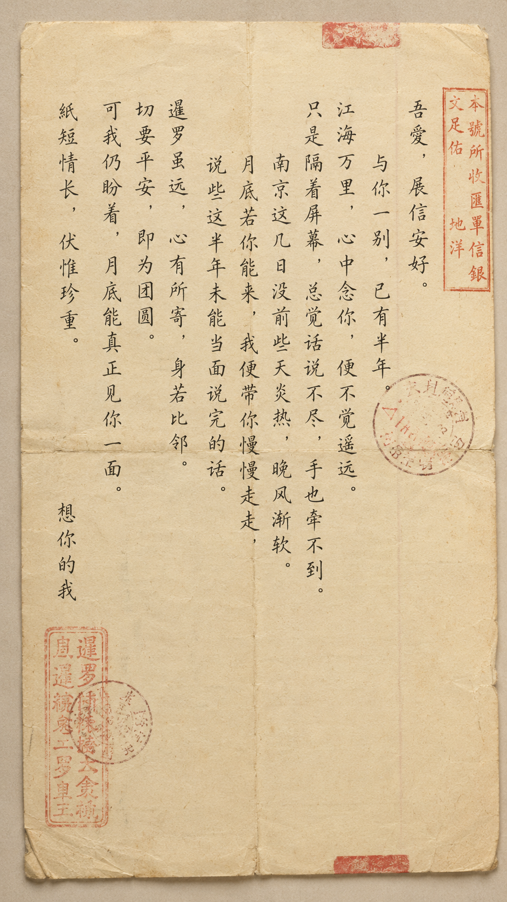

# 给阿嬷的情书 Skill

> Love Letter to A-Ma: 写一封像旧时侨批一样的中文情书。


一个专门代写中文情书、家书、道歉信、挽回信、告别信与手写卡片文案的 Codex / GPT Skill。

它的气质来自旧时侨批：远行的人寄回一封信、一点钱、一句平安；守家的人把冬至丸和过年碗筷都留好。它写的不是喊出来的爱，而是藏在饭菜、路程、月亮、江水、天气和一句“你要好好顾着自己”里的中式浪漫。

## Demo

> 这里预留给你的文字卡片、手写信、侨批信笺截图。把图片放进 `assets/` 文件夹后，取消对应行的注释或替换文件名即可。

<!--



-->

| 文字卡片 | 手写信 | 侨批信笺 |
| --- | --- | --- |
|  |  |  |

## 目录

- [它适合写什么](#它适合写什么)
- [风格关键词](#风格关键词)
- [灵感内核](#灵感内核)
- [使用方式](#使用方式)
- [默认输出](#默认输出)
- [支持的输出形式](#支持的输出形式)
- [图片生成玩法](#图片生成玩法)
- [场景示例](#场景示例)
- [写作边界](#写作边界)
- [为什么要做这个-skill](#为什么要做这个-skill)

## 它适合写什么

- 异地恋思念信
- 男生给女生、女生给男生的情书
- 表白信、暗恋信、纪念日信、生日卡片
- 道歉信、解释误会、冷战破冰
- 挽回信、复合信，但不卑微、不施压
- 分手告别、释怀祝福
- 睡前短笺、礼物附信、花束卡片
- 长辈口吻、旧式家书、侨批风信件
- 替亡人、替长辈、替某个未能开口的人写一封信
- 文字卡片、手写信图片、侨批信笺图片的文案与提示词

## 功能一览

| 能力 | 适用场景 | 输出特点 |
| --- | --- | --- |
| 写完整信件 | 异地、表白、道歉、挽回、纪念日 | 600-900 字，能直接复制或手写 |
| 写短讯 | 微信、短信、睡前消息 | 80-200 字，克制但有温度 |
| 写卡片 | 花束、礼物、生日、纪念日 | 150-350 字，适合印在卡片上 |
| 润色原文 | 用户已有草稿 | 保留原意，提升节奏、体面度和中文质感 |
| 生成图片提示词 | 手写信、文字卡片、侨批信笺 | 先压缩文字，再给中文画面提示词 |
| 守住边界 | 挽回、告别、冷战、拒绝后联系 | 不勒索、不逼迫、不纠缠 |

## 风格关键词

克制，温柔，旧信感，家书感，酸涩但体面，深情但不压迫，朴素但有后劲。

```text
不是“你是我的全世界”，
而是“冬至丸留你一份，过年碗筷亦为你备”。
```

它会尽量避免“你是我的全世界”“命中注定”“没有你我活不下去”这类油腻或勒索式表达，而是写成：

> 南京这几日天气没前些天那样热了，晚风也软了些。若月底你能来，我便带你慢慢走一走。不必赶什么行程，只要你在我身旁，吃一顿热饭，说些这半年没能当面说完的话，我便觉得很好。

## 灵感内核

这个 Skill 的核心设定是《给阿嬷的情书》式的侨批情书：

- 阿嬷叶淑柔在潮汕老家等待。
- 郑木生下南洋到暹罗 / 泰国谋生，文盲，几乎不会写字。
- 谢南枝受木生救命之恩，在木生死后，以“木生”的名义给淑柔写了 18 年信、寄了 18 年钱。
- 所谓“给阿嬷的情书”，不是孙子写给阿嬷，而是“以阿公名义写给阿嬷”的侨批情书。

Skill 内完整收录并强制复用了一批核心原话与句式，例如：

> 江海万里，心中念你，便不觉遥远。

> 我的心只有一个，不能砍成两半。一心不能二用。

> 暹罗虽远，心有所寄，身若比邻。切要平安，即为团圆。

> 冬至丸留你一份，过年碗筷亦为你备。虽你未归，日子仍按你在时过。

这些句子会被转译到现代关系里：异地、冷战、道歉、挽回、生日、重逢、告别，都能带着旧信的温度落地。

## 使用方式

把 `gei-ama-de-qingshu` 文件夹放到你的 Codex Skills 目录中，或把 `SKILL.md` 内容复制给支持自定义指令 / 项目知识 / GPTs 的模型使用。

在 Codex 中可以直接说：

```text
使用 $gei-ama-de-qingshu：
我是男生，和女朋友异地半年，想表达思念，并邀请她月底来南京见面。
最近南京没前几天那么热了。语气克制、温柔、旧信感。
```

也可以给网页版 GPT：

```text
请使用下面这个 Skill 的规则，为我代写一封信。
我的身份：男生
对方：女朋友
处境：异地半年，想念她，想邀请她月底来南京见面
语气：克制、温柔、像旧家书，不要太肉麻

[粘贴 SKILL.md 内容]
```

## 默认输出

当用户已经给出角色和处境时，Skill 默认直接交付成品：

```text
语气：克制、温柔、旧信感。

正文：
吾爱，展信安好。
……

短讯版：
……
```

如果信息不足，它最多温和确认 5 个问题，不会盘问：

- 你是谁？
- 对方是谁？
- 现在是什么处境？
- 想要什么语气？
- 有什么可以写进去的细节？

如果用户只说“帮我写”，默认生成 600-900 字，语气为克制、温柔、旧信感、中式浪漫。

## 支持的输出形式

- 完整信件：默认 600-900 字，适合复制发送或手写。
- 微信短讯版：80-200 字，适合直接发。
- 手写卡片版：150-350 字，适合礼物、花束、生日卡。
- 三版语气：克制版、温柔版、诗意版。
- 模板版：保留 `[名字]`、`[回忆]`、`[承诺]` 等可替换字段。
- 润色版：保留原意，只提升节奏、语气和体面度。
- 图片生成版：先给适合入图的短文，再给中文图片提示词。

## 图片生成玩法

这个 Skill 不只会写信，也能帮你把信变成适合图片模型的提示词。

示例请求：

```text
使用 $gei-ama-de-qingshu：
给我一版适合生成手写信图片的短文和图片提示词。
内容是异地半年，想邀请她月底来南京见面。
```

它会先把长信压缩成适合入图的短句，例如：

```text
与你异地半年，心里常像空着一副碗筷。
南京这几日没前些天热了，晚风也软。
月底若你能来，我想陪你慢慢走一走，
吃顿热饭，把这半年没说完的话，当面说给你听。
```

再给出类似这样的中文图片提示词：

```text
生成一张中文手写信图片。画面是一张米白色旧信纸，纸面有轻微折痕和自然纸纹，放在温暖木桌上，旁边有一只旧信封。信纸上用深褐色钢笔字写着：“与你异地半年，心里常像空着一副碗筷。南京这几日没前些天热了，晚风也软。月底若你能来，我想陪你慢慢走一走，吃顿热饭，把这半年没说完的话，当面说给你听。”整体氛围中式、克制、温柔、像久别后寄来的家书。自然窗光，浅景深，文字清晰端正，留白充足。不要英文，不要拼音，不要西式玫瑰海报，不要爱心贴纸，不要乱码，不要错别字。
```

## 场景示例

### 异地思念

```text
我是女生，和男朋友异地三个月。他最近工作很累，我想写一封睡前信给他，温柔一点，像家书，不要太肉麻。
```

### 冷战破冰

```text
我是男生，和女朋友冷战三天了。起因是我说话太冲。想先递台阶，再认真道歉，不要显得油腻。
```

### 克制表白

```text
我是暗恋者，喜欢一个女生很久。我们一起走过一段夜路，她说过喜欢晚风。我想表白，但不想逼她回答。
```

### 成年人挽回

```text
我是前任，想挽回。我们分开是因为我以前总逃避沟通。请写得成熟一点，承认问题，说清楚以后怎么改，不要哭求。
```

### 体面告别

```text
我想给前任写一封告别信。感谢她陪过我一段路，也祝她以后平安，不要留下复合暗示。
```

## 写作边界

这个 Skill 重视体面与边界。它不会帮助生成：

- 情绪勒索：没有你我活不下去、你不回来我就怎样。
- 道德绑架：我都这样了你还不原谅我。
- 纠缠骚扰：明知对方拒绝还继续施压。
- 霸道占有：你只能属于我。
- PUA、操控、威胁、逼迫复合。
- 婚外诱导、破坏他人关系、诱导越界。

遇到这类请求，它会改写成尊重边界、诚实说明、体面告别或自我负责的版本。

## 为什么要做这个 Skill

很多中文情书要么太现代网感，要么太像翻译腔；要么用力过猛，要么空泛无物。

这个 Skill 想保留一种更东方、更旧、更慢的表达方式：不急着把爱喊出来，而是让它落在“吃饭了吗”“天冷添衣”“我把碗筷给你留着”“月底若能见你，我带你慢慢走一走”这些细节里。

它不是只会写漂亮句子，而是先判断这封信真正要完成什么事：

- 表白时，不逼迫答案。
- 道歉时，不用深情掩盖错误。
- 挽回时，写改变和边界，不哭求。
- 告别时，感谢和放手，不留下钩子。
- 异地时，写分享欲，也写不能陪伴的亏欠。

温柔要有分寸，深情要有骨头。

## 文件结构

```text
gei-ama-de-qingshu/
├── SKILL.md
├── README.md
└── agents/
    └── openai.yaml
```

## 许可证

如果你要公开发布，建议自行添加 `LICENSE` 文件。可选 MIT、Apache-2.0，或根据你的素材来源与使用意图选择更合适的许可证。

## 一句话介绍

给阿嬷的情书 Skill：把现代人的表白、思念、道歉、挽回与告别，写成一封有旧时侨批气息的中文家书。
